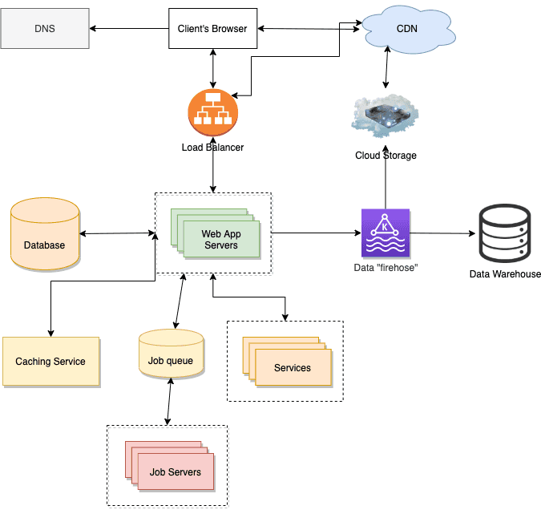

# Resumen Arquitectura Web

## 1 Introducción

En informática, la World Wide Web (www) es un sistema de distribución de documentos electrónicos escritos en HTML (HyperText Markup Language) llamados páginas web, que se enlazan entre sí a través de hiperenlaces (links). Las páginas web pueden contener imágenes, textos, audio, vídeo y otros contenidos.

Normalmente las páginas web se agrupan en sitios web, compartiendo la primera parte de la dirección web (el dominio). Ejemplos:

- [https://www.ieselcaminas.org](http://www.ieselcaminas.org): Sitio web del Instituto
- [https://es.wikipedia.org](http://es.wikipedia.org): Sitio web de la Wikipedia en español

## 2 Aplicaciones web

### 2.1 ¿Qué es una aplicación web? Beneficios

Es una aplicación software que se utiliza accediendo a un servidor web mediante un navegador web. Sus beneficios respecto a las aplicaciones tradicionales son:

- Multiplataforma y multiusuario, aumentan su versatilidad.
- Gestión y mantenimiento centralizado, reducen costes.
- Datos centralizados, facilitan el acceso y el control.

### 2.2 Procesamiento de las aplicaciones web. Servidor.

Una aplicación web consiste en un conjunto de páginas web **estáticas** (se envían al navegador sin modificar su diseño original) y **dinámicas** (según la interacción con el usuario, son procesadas y modificadas antes de enviarlas).

*Fig.1 - Webs estáticas y dinámicas ([fuente](https://emprendecontuweb.com/algunos-conceptos-basicos-en-diseno-web/))*

Cuando el servidor web recibe una petición para mostrar una página web dinámica, la transfiere al **servidor de aplicaciones**, que se encarga de buscar instrucciones en la página recibida, procesarlas y montar la página que se enviará finalmente al navegador.

#### 2.2.1 Páginas dinámicas con acceso a bases de datos

El uso de una base de datos para almacenar contenido permite separar el diseño del sitio web del contenido que se desea mostrar, de modo que sólo se necesita escribir una página para mostrar diferentes datos a diferentes usuarios.

Cuando se requieren datos de la base de datos, el servidor de aplicaciones realiza una consulta al controlador de la base de datos en lenguaje SQL y éste le devuelve los registros correspondientes, que se emplean para completar la página.

*Fig.2 - Acceso a base de datos ([fuente](https://javiergarciaescobedo.es/despliegue-de-aplicaciones-web/76-arquitecturas-web/253-modelos-de-arquitecturas-web))*

### 2.3. Visualización de páginas. Lado del cliente

Desde el punto de vista del **cliente web** (generalmente el navegador) las páginas que componen una aplicación web también se pueden dividir en estáticas y dinámicas.

- **Estáticas**: el contenido visualizado por el cliente no cambia (puede cambiar de página, pero no cambia la página en sí)
- **Dinámicas**: el contenido visualizado cambia dentro de la misma página, usando técnicas de manipulación del DOM y peticiones asíncronas (Single Page Application)

#### 2.3.1 Generadores de sitios estáticos (**SSG**) 

Los generadores de sitios estáticos funcionan convirtiendo texto simple y con formato ligero (generalmente [markdown](https://es.wikipedia.org/wiki/Markdown)) en sitios web, aplicando datos y contenido a las plantillas y generando una vista de una página, lo que facilita mucho servir el contenido, bien desde un servidor web simplificado o una red de distribución de contenido (CDN).

Además tienen una ventaja muy importante desde el punto de vista de la seguridad: simplifican mucho la infraestructura involucrada en servir el contenido, de modo que se minimizan los vectores de ataque.

*Fig.3 - Flujo en SSG ([fuente](https://victorponz.github.io/Ciberseguridad-PePS/tema1/http/2020/11/04/Arquitectura-web-Conceptos-generales.html#34-aplicaci%C3%B3n-web))*

Algunos ejemplos de SSG son por ejemplo: [Jekill](http://jekyllrb.com/), [Hexo](https://hexo.io/), [Hugo](http://gohugo.io/), [Pelican](http://getpelican.com/), [Middleman](https://middlemanapp.com/), [Metalsmith](http://www.metalsmith.io/), [Ghost](https://ghost.org/)... Y una de las **mayores plataformas para desplegar** Stactic Site Generators es https://www.netlify.com/

## 3 Tecnologías de desarrollo Web

Hoy en día existe una gran cantidad de tecnologías para desarrollar aplicaciones web, por lo que es importante elegir cuál es la más adecuada para tu proyecto. Existen dos enfoques en el desarrollo de aplicaciones web:

- Creación de aplicaciones web con [integración de tecnologías de desarrollo](https://victorponz.github.io/Ciberseguridad-PePS/tema1/http/2020/11/04/Arquitectura-web-Conceptos-generales.html#41-integración-de-tecnologías-de-desarrollo)
- Creación de aplicaciones web con [sistemas gestores de contenido](https://victorponz.github.io/Ciberseguridad-PePS/tema1/http/2020/11/04/Arquitectura-web-Conceptos-generales.html#42-sistemas-gestores-de-contenido-cms)

## 5 Servidores web y de aplicaciones

Si se escoje implementar la aplicación con Java se usará un servidor de aplicaciones, mientras si se escoje PHP o ASP.NET se usará un servidor web. A continuación se definirán los conceptos de servidor web y servidor de aplicaciones:

### 5.1 Servidor Web

El servidor web controla el protocolo http. Si el servidor web recibe una solicitud por protocolo http responderá con una respuesta http.

El servidor web no proporiciona ninguna funcionalidad más que proporicionar un entorno en el que el programa del lado del servidor puede ejecutar y devolver las respuestas generadas.

### 5.2 Servidor de aplicaciones

El servidor de aplicaciones proporiciona acceso a la lógica empresarial para su uso por los programas de aplicación del cliente.

## 6 Despliegue de Aplicaciones web

Cuando se crea una aplicación weben el ordenador se suele hacer en entorno de desarrollo al que solo se puede acceder desde el mismo ordenador.

En el entorno de desarrollo local o localhost el codigo de la aplicación se mantiene en el ordenador y será accesible únicamente desde el mismo ordenador. Si se desde que sea accesible por todo el mundo se necesita ponerla en un ordenador públlico, accesible a trevés de una URL.

El proceso de mover una aplicación web desde localhost a un servidor web se denomina despliegue.

El proceso de mover una aplicación web desde localhost a un servidor web se denomina despliegue.

En el momento que se desplega la aplicación en un servidor web se dispone de una versión públicamente disponible para cualquier usuario y al mismo tiempo se sigue disponiendo de la versión privada donde se usa para retocar y probar posible nuevo contenido.

## Caso real de despliege de aplicaciones web (Storyblocks)

En este caso se excpone el proceso de busqueda en google de una imagen donde en el navegador se mustra como primera opción Storyblocks, si el usuario eliga está opción entonces el usuario envia una solicitud al servidor DNS para buscar como conectarse al sitio web. La silicitud enviada llega al balanceador de carga  para elegir el servidor más adecuado del sitio web. El servidor muestra la vista como html y luego la envía al navegador del usuario pasando a través del equilibrador de carga y al final muestra la página al usuario.

A continuación se expone la estructura de la aplicación web Storyblocks:

- DNS: Que proporciona una búsqueda de clave / valor  desde un nombre de dominio a una dirección IP, ya que la dns es necesaria para que el ordenador del usuario enrute una solicitud al servidor de la página de busqueda.

- Balanceador de carga: Enrutan las solicitudes entrantes a uno de los servidores de la aplicación web y envían la respuesta desde el servidor de la aplicación al usuario.

- Servidores de aplicaciones web: Reciben la solicitud de un usuario y envían de vuelta un html al navegador del usuario que realiza la busqueda.

- Servidores de bases de datos: Es donde la aplicación web almacena la información que ha solicitado el usuario a la hora de realizar la busqueda.

- Servicio de caché: Se aprovecha para guardar los resultados de los cálculos costosos.

- Servicio de búsqueda de texto completo: Es una función que el servidor de la aplicación web ofrece para facilitar la busqueda del usuario e forma más rápida.
- Servicios.
- Datos.
- Almacenamiento en la nube: Es una forma para almacenar las entradas de busqueda de los usuarios para posibles futuras busquedas de los mismos.

---

